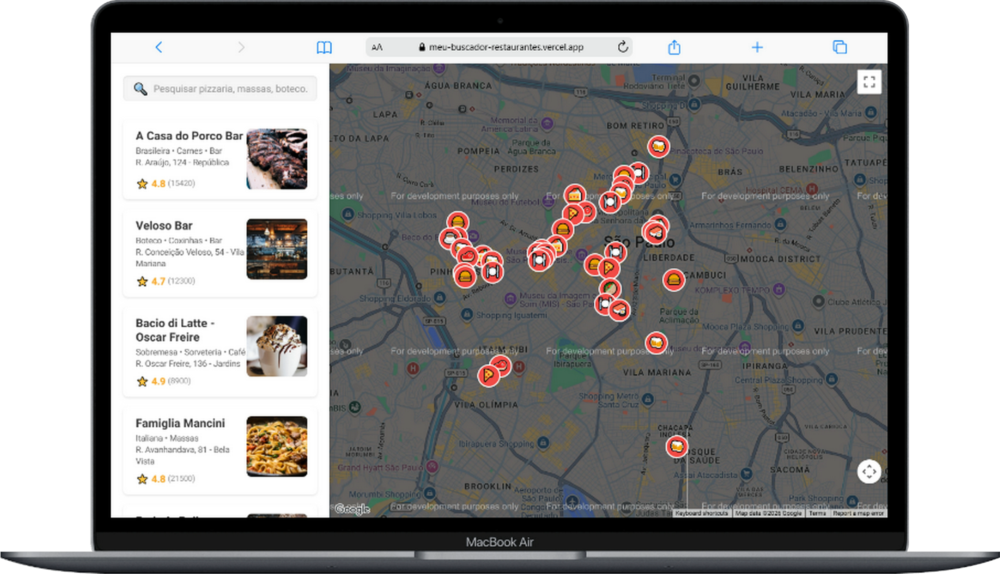
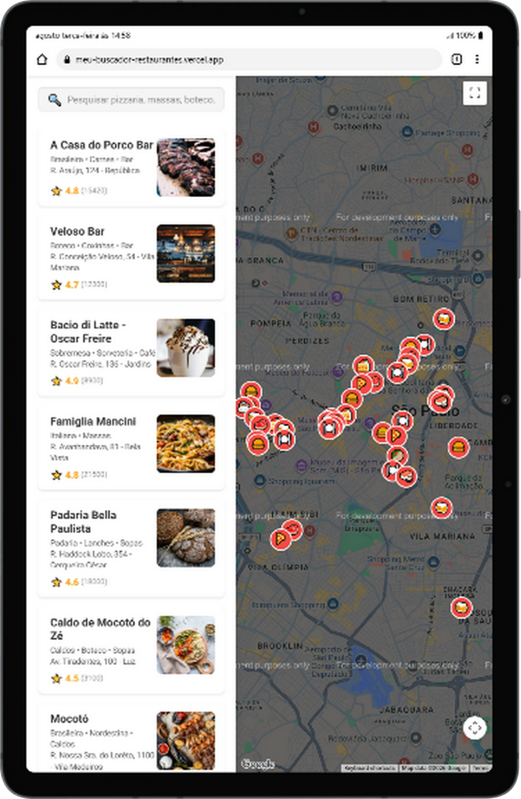

# 🍔 Buscador de Restaurantes: Arquitetura Moderna e UX 🗺️

E aí, meu 🐙! Bem-vindo(a) a mais um repositório da minha jornada como Desenvolvedora Front-End! 

Este projeto foi desenvolvido com o objetivo de recriar e modernizar o desafio prático "Site para Encontrar Restaurantes" do Bootcamp MRV Front End SPA Developer da DIO, no módulo Avançado **Desafio de projeto: Criando um Site para Encontrar Restaurantes Usando Google Maps que Consulta API do Google**. Mais do que apenas seguir um tutorial, utilizei este projeto para praticar e aprofundar meus conhecimentos em **React.js**, saindo da minha zona de conforto (Angular) para expandir meu repertório de ecossistemas Front-End. Aqui, apliquei e consolidei conceitos importantes para criar uma aplicação resiliente, interativa, escalável e com forte foco na Experiência do Usuário (UX).

---

## 🎥 Veja o Projeto em Ação!

Que tal dar uma olhada no projeto rodando ao vivo?
[[Acessar o Deploy do Projeto]](https://meu-buscador-restaurantes.vercel.app/)

<br>
<div align="center">
    
    
</div>
<br>

---

## 💡 Funcionalidades Destaque

* Filtro em tempo real alimentado por `useEffect`, que busca restaurantes por nome ou categoria (ex: "Pizza", "Boteco", "Sobremesa") ignorando *case sensitive*.
* A lista da barra lateral e os marcadores (pins) no mapa compartilham o mesmo estado global. Ao filtrar na busca, o mapa atualiza instantaneamente.
* Em vez de usar imagens pesadas ou depender de renderizadores 3D instáveis, os marcadores no mapa são gerados dinamicamente via código SVG, exibindo emojis contextuais (🍕, ☕, 🍣) de acordo com o tipo de comida.
* Se a busca do usuário não retornar resultados, a interface não gera um "beco sem saída". Um aviso amigável e um botão de ação rápida (Call to Action) permitem resetar a lista inteira com um clique.

---

## 🧠 Decisões Técnicas (Por trás do código)

Como estudante apaixonada por **Angular**, decidi encarar este projeto em **React** para dominar outros paradigmas do mercado (como o fluxo unidirecional de dados e Hooks). Durante o desenvolvimento, tomei decisões arquiteturais importantes para garantir que o projeto tivesse nível de produção:

1. Abandonei a estrutura legada do `Create React App` proposta no curso original e iniciei o projeto do zero usando **Vite** para maior performance. Adicionei **TypeScript** para ter a segurança e a previsibilidade de tipagem que já utilizo no Angular.
2. O Google deprecous o `PlacesService` para novas contas e bloqueou requisições sem faturamento ativo. Em vez de travar o projeto, criei uma arquitetura de *Fallback*. Projetei um **Mock Data** robusto estruturado em JSON com 41 estabelecimentos reais de São Paulo, incluindo coordenadas exatas de *Latitude/Longitude* para permitir futuros cálculos de distância.
3. A API moderna de marcadores do Google (`AdvancedMarkerElement`) causou falhas de contexto WebGL (`Error 10`) em testes locais por exigir renderização vetorial pesada. Para garantir a acessibilidade em qualquer máquina, reverti para o motor *Raster* clássico, mas injetei **SVGs dinâmicos via Data URIs** direto no JavaScript, entregando um visual moderno sem risco de *crashes*.
4. Substituí o CSS convencional por `styled-components` (CSS-in-JS), garantindo estilos isolados por componente e manipuláveis via propriedades do React.

---

## 🛠 Tecnologias Utilizadas

* **React (Hooks):** Uso massivo de `useState` e `useEffect` para controle de estado e ciclo de vida, aplicando o padrão *Lifting State Up* para comunicação entre a Lupa e o Mapa.
* **TypeScript:** Tipagem rigorosa de propriedades (Interfaces), *Type-Only Imports* e tipagem de eventos sintéticos do React (`ChangeEvent`, `KeyboardEvent`).
* **Styled-Components:** Estilização componentizada com CSS moderno, incluindo customização elegante de barras de rolagem (Scrollbars) e *Pseudo-classes*.
* **@react-google-maps/api:** Integração nativa e assíncrona do canvas do Google Maps via o hook `useJsApiLoader`.
* **Vite:** Ferramenta de build de altíssima velocidade.

---

## 🗺️ Roadmap de Evolução (Implementações Futuras)

Este projeto está em constante evolução. As próximas Sprints planejadas para lapidar ainda mais a UX/UI são:

- [ ] **Sprint 1 (A Lupa):** Substituição do emoji da barra de pesquisa por um ícone SVG real de biblioteca profissional (ex: Lucide React), tornando o ícone clicável para disparar a busca (além do "Enter").
- [ ] **Sprint 2 (Filtros Avançados & Chips):** Implementação de "pílulas" (Chips) clicáveis abaixo da busca para filtros rápidos (ex: "Aberto Agora", "Mais Baratos", "Pizzaria") e ordenação por nota/nome.
- [ ] **Sprint 3 (Overlays e Detalhes):** Ao clicar em um Card, escurecer a tela e abrir um modal/painel flutuante detalhado contendo a foto expandida, endereço, link do website, e distância real (calculada a partir da geolocalização).
- [ ] **Sprint 4 (Mobile First):** Adaptação completa da responsividade. Em smartphones, a barra lateral se transformará em uma "gaveta" (bottom sheet) expansível sobre o mapa.
- [ ] **Sprint 5 (Status em Tempo Real):** Adicionar indicadores visuais de "Aberto" (Verde) ou "Fechado" (Vermelho) diretamente nos Cards, baseados na lógica de horário do Mock.

---

## ⚙️ Como Rodar o Projeto (Localmente)

1. **Clone este repositório:**
   ```bash
   git clone [https://github.com/miriaamaral/meu-buscador-restaurantes.git](https://github.com/miriaamaral/meu-buscador-restaurantes.git)
   ```
2. **Entre na pasta do projeto:**
  ```bash
  cd buscador-restaurantes
  ```
3. **Instale as dependências:**
  ```bash
  npm install
  ```
4. **Configure a Chave de API:**
- Crie um arquivo .env na raiz do projeto e adicione sua chave do Google Maps:
```bash
Snippet de código
VITE_GOOGLE_API_KEY=sua_chave_de_api_aqui
```
5. **Execute o projeto:**
  ```bash
  npm run dev
  ```
6. **Abra no navegador através do link gerado no terminal** (geralmente http://localhost:5173/).

## ✉️ Contato

Vamos nos conectar e construir algo incrível juntos!

* **LinkedIn:** [Miriã Amaral](https://www.linkedin.com/in/miriaamaralcs)
* **GitHub:** [miriaamaral](https://github.com/miriaamaral)
* **Email:** [miriaamaralcs@gmail.com](mailto:miriaamaralcs@gmail.com)
* **Discord:** [miriaamaralcustodiosantos](https://discord.com/channels/miriaamaralcustodiosantos)

---

<p align="center">Feito com ❤️ por Miriã Amaral</p> 